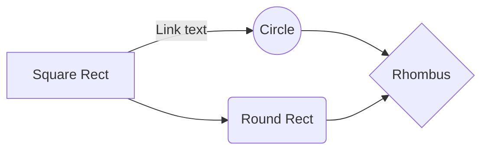

# Краткий обзор возможностей Markdown

## 1. Заголовки

# Заголовок 1
## Заголовок 2
### Заголовок 3
#### Заголовок 4
##### Заголовок 5
###### Заголовок 6


## 2. Списки

- Item A
- Item B
- Item C
    - Item C 1
    - Item C 2

1. Item A 
2. Item B
3. Item C

- [x] GFM task list 1
- [x] GFM task list 2
- [ ] GFM task list 3
    - [ ] GFM task list 3-1
    - [ ] GFM task list 3-2
    - [ ] GFM task list 3-3
- [ ] GFM task list 4
    - [ ] GFM task list 4-1
    - [ ] GFM task list 4-2

## 3. Цитаты

Текст текст текст
> Первый уровень цитирования
>> Второй уровень цитирования
>>> Третий уровень цитирования
>
>Первый уровень цитирования


## 4.  Ссылки

[Links](http://localhost/)
[Links with title](http://localhost/ "подсказка")

[Reference link][id/name]

[id/name]: http://link-url/
> ссылка хранится в сноске по имени, которое не чувствительно к регистру
> (можно так все ссылки определить внизу как источники)


## 5. Выделение текста

- Обычный текст `выделенный текст (часть кода, переменная или другое важное замечание)`.
- ~~Зачёркивание~~
	- <s>тэг \<s\>. </s> 
	- <del>тэг \<del\></del>
- Курсив
	- *Italic* 
	- _Italic_
- Жирный
	- **Emphasis**
	- __Emphasis__
- Жирный курсив 
	- ***Emphasis Italic*** 
	-  ___Emphasis Italic___
- Подстрочный элемент: O<sub>2</sub>
- Надстрочный: x<sup>2</sup>
- Расшифровка аббревиатуры:
	The <abbr title="Hyper Text Markup Language">HTML</abbr> specification is maintained by the <abbr title="World Wide Web Consortium">W3C</abbr>.
- Экранирование -  \*текст\*

## 6. Выделение участка кода:

```bash
echo "Hello"
``` 
```python
print('hello')
```
```html
<!DOCTYPE html>
<html>
    <head>
        <mate charest="utf-8" />
        <title>Hello world!</title>
    </head>
    <body>
        <h1>Hello world!</h1>
    </body>
</html>
```
```js
console.log('hello')
```
```
другой код без определения стиля и синтаксиса
```

## 7. Добавление таблиц

#### Таблица :

First Header  | Second Header
------------- | -------------
Content Cell  | Content Cell
Content Cell  | Content Cell

| First Header  | Second Header |
| ------------- | ------------- |
| `Content Cell`| Content Cell  |
| `Content Cell`| Content Cell  |

#### Выделенная таблица:

	   | First Header  | Second Header |
	   | ------------- | ------------- |
	   | Content Cell  | Content Cell  |
	   | Content Cell  | Content Cell  |

#### Выравнивание текста в колонках

| по левому краю  | по центру  | по правому краю |
| :------------ |:---------------:| -----:|
| слева | центр | справа |


## 8. Изображения

#### Обычное изображение


> какая-то цитата про картинку

#### Изображение + ссылка
[](https://pandao.github.io/editor.md/examples/images/8.jpg "описание ссылки")


## 9. HTML символы и смайлы

&copy; &  &uml; &trade; &iexcl; &pound;
&amp; &lt; &gt; &yen; &euro; &reg; &plusmn; &para; &sect; &brvbar; &macr; &laquo; &middot; 

X&sup2; Y&sup3; &frac34; &frac14;  &times;  &divide;   &raquo;

18&ordm;C  &quot;  &apos;

 :smiley:  :star:
 
 [](#)

## 10.  Формулы
[KaTeX](https://khan.github.io/KaTeX/) - подробнее о формулах

$E=mc^2$

$$\sqrt{3x-1}+(1+x)^2$$

$$sin(\alpha)^{\theta}=\sum_{i=0}^{n}(x^i + \cos(f))$$

$$\Gamma(n) = (n-1)!\quad\forall n\in\mathbb N$$

$$\Gamma(z) = \int_0^\infty t^{z-1}e^{-t}dt\ $$


## 11. Диаграммы UML

[Mermaid](https://mermaidjs.github.io/) - подробнее про построение диаграмм



## 13.  Источники и онлайн-редакторы
- <https://stackedit.io/>
- <https://pandao.github.io/editor.md/en.html>
- <http://jbt.github.io/markdown-editor>
- [https://shields.io/](https://shields.io/) - красивые информативные статусы проекта
[](#)
